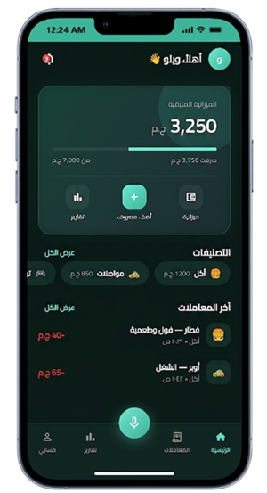
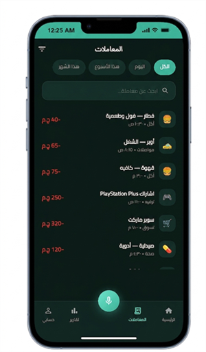
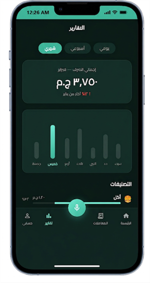
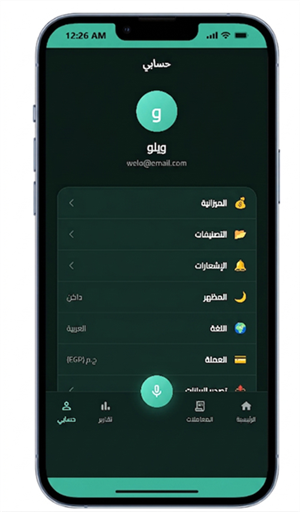
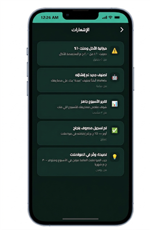

# 👛 Walleta (وليتة) — Personal Finance Management App

**Walleta** is a sleek, modern, personal finance management mobile application built with **Flutter** and **Dart**. Designed with an Arabic-first Right-To-Left (RTL) interface and a dark-mode fintech aesthetic, Walleta helps users effortlessly track expenses, manage budgets, analyze spending trends, and log expenses using **voice recognition simulation** and **AI-powered insights**.

---

## 📱 App Screenshots Showcase

| Dashboard | Transactions | Reports |
| :---: | :---: | :---: |
|  |  |  |

| Profile / Account | Notifications Center |
| :---: | :---: |
|  |  |

---

## ✨ Features

- 📊 **Dashboard & Balance Overview**: Real-time remaining budget card, spent ratio progress bar, and recent transactions preview.
- 🎙️ **Voice-Based Expense Logging**: Simulated voice interaction state machine (`Idle` → `Listening` → `Analyzing` → `Parsed`) extracting amounts, items, and auto-categorizing expenses.
- 💸 **Transaction Management**: Searchable transaction history with date-range filters (All, Today, This Week, This Month), transaction details view, and deletion.
- 🎯 **Smart Budget Tracking**: Interactive budget limit slider (1,000 to 50,000 EGP), category budget allocations, and custom circular gauge visualizer.
- 📂 **Category Categorization**: Pre-configured categories (Food 🍔, Transport 🚕, Entertainment 🎮, Health 💊, Shopping 🛒, Bills 📱, Education 📚) with spent percentage indicators.
- 📈 **Reports & Spending Analysis**: Daily/Weekly/Monthly report toggles, spending bar charts, category progress breakdowns, and AI-generated advice cards.
- 🤖 **AI-Powered Insights**: Smart financial tips analyzing user spending patterns to encourage better saving habits.
- 🔔 **Notifications Center**: Real-time notification list with unread counters for budget warnings, AI suggestions, and transaction alerts.
- 👤 **User Profile & Preferences**: Account summary, currency preferences (EGP), Arabic language defaults, dark theme configuration, and export options.
- 🚀 **Onboarding & Splash Flow**: Animated splash screen and a 3-step carousel introducing voice logging, smart categorization, and analytics.

---

## 🛠️ Tech Stack

- **Core Framework**: [Flutter](https://flutter.dev/) (SDK `^3.11.1`)
- **Language**: [Dart](https://dart.dev/)
- **State Management**: [`provider`](https://pub.dev/packages/provider) (`^6.1.2`)
- **Typography & Styling**: [`google_fonts`](https://pub.dev/packages/google_fonts) (Cairo & Inter fonts)
- **Localization**: `flutter_localizations` & [`intl`](https://pub.dev/packages/intl) (`^0.20.2`) for Arabic RTL layout and currency formatting
- **Icons**: [`cupertino_icons`](https://pub.dev/packages/cupertino_icons) & Material Design Icons

---

## 📂 Project Structure

```text
walleta_app/
├── assets/
│   └── screenshots/        # Application screenshot previews for GitHub
├── lib/
│   ├── core/
│   │   ├── constants/      # App colors, strings, and global constants
│   │   └── theme/          # Custom Dark Theme configuration & typography
│   ├── features/           # UI screens grouped by feature domain
│   │   ├── splash/         # Splash screen
│   │   ├── onboarding/     # 3-step onboarding carousel
│   │   ├── dashboard/      # Home dashboard & main navigation shell
│   │   ├── voice/          # Voice recording & confirmation screens
│   │   ├── transactions/   # Transaction list, detail & manual add screens
│   │   ├── reports/        # Analytics & spending reports screens
│   │   ├── budget/         # Budget gauge & limit configuration screen
│   │   ├── categories/     # Category grid & category detail screens
│   │   ├── profile/        # User profile & settings screen
│   │   └── notifications/  # Notification center screen
│   ├── models/             # Immutable data models
│   │   ├── transaction.dart
│   │   ├── category.dart
│   │   ├── budget.dart
│   │   ├── notification_item.dart
│   │   └── user_profile.dart
│   ├── providers/          # Provider state notifiers
│   │   ├── transaction_provider.dart
│   │   ├── budget_provider.dart
│   │   ├── voice_provider.dart
│   │   └── notification_provider.dart
│   ├── widgets/            # Reusable custom UI components
│   │   ├── balance_card.dart
│   │   ├── category_chip.dart
│   │   ├── transaction_tile.dart
│   │   ├── voice_fab.dart
│   │   ├── custom_bottom_nav.dart
│   │   ├── circular_gauge.dart
│   │   ├── spending_bar_chart.dart
│   │   └── ai_insight_card.dart
│   └── main.dart           # App entry point with MultiProvider & MaterialApp
└── pubspec.yaml            # Dependencies & assets configuration
```

---

## 🏛️ Architecture & Code Organization

The application follows a **Feature-First Clean Architecture** combined with the **Provider** state management pattern:
- **Presentation Layer**: UI widgets and screens (`lib/features` and `lib/widgets`) consume application state reactively via `context.watch()` and `context.read()`.
- **State Management Layer**: `ChangeNotifier` classes (`lib/providers`) encapsulate business logic, data manipulation, filtering, and timer state machines.
- **Domain/Data Layer**: Plain Dart data models (`lib/models`) represent transactions, categories, budgets, and user settings cleanly.

---

## 🎨 UI & Design Approach

- **Theme Palette**: Rich dark background (`#0A1A16`), deep teal card containers (`#132E28`), and vibrant gradient accents (`#6EECD4` → `#3CB89C`).
- **Typography**: Arabic Cairo font for headings and body text combined with Inter for numbers and brand monograms.
- **RTL First**: Built-in support for Right-To-Left directionality tailored for Arabic users.

---

## 🚀 Getting Started

Follow these instructions to run the project locally on your machine.

### Prerequisites
- [Flutter SDK](https://docs.flutter.dev/get-started/install) (`v3.11.1` or higher)
- [Dart SDK](https://dart.dev/get-started)
- Android Studio / Xcode / VS Code with Flutter extension

### Installation

1. **Clone the Repository**:
   ```bash
   git clone https://github.com/khloudragheb/walleta_app.git
   ```

2. **Navigate into the Project Directory**:
   ```bash
   cd walleta_app
   ```

3. **Install Dependencies**:
   ```bash
   flutter pub get
   ```

4. **Run the Application**:
   ```bash
   flutter run
   ```

---

## 🔮 Future Improvements

- 💾 **Local Data Persistence**: Implement SQLite or Hive database storage for offline retention.
- ☁️ **Cloud Backend Sync**: Integrate Firebase or REST APIs for user authentication and cloud synchronization.
- 🎙️ **Speech Recognition**: Connect native speech-to-text hardware APIs for live voice recording.
- 📄 **Export Reports**: Export monthly financial reports to PDF or CSV formats.

---

## 👤 Author

**Khloud Ragheb**
- **GitHub**: [@khloudragheb](https://github.com/khloudragheb)
